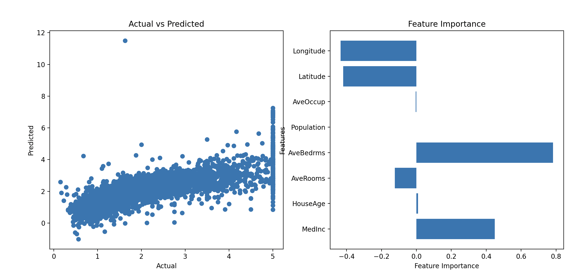

# Machine Learning House Price Prediction

## California Housing Dataset

### 1. Try only with 2 features(`HouseAge`, `AveBedrms`) [[details](https://github.com/vanngoh/ml-house-price-prediction/pull/2)]
   > MSE: 1.2940659833936516  
   > R2: 0.012471674964549484
  
  

### 2. Enhance with full features [[details](https://github.com/vanngoh/ml-house-price-prediction/pull/3)]
   > MSE: 0.5558915986952437  
   > R2: 0.5757877060324512

   